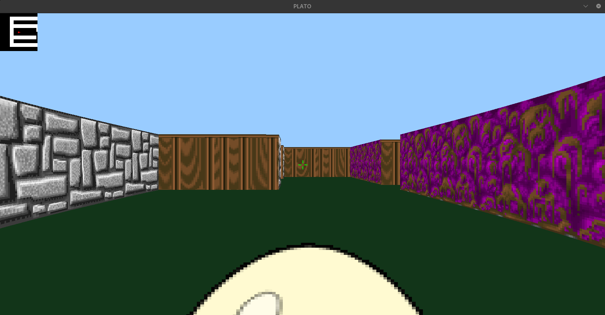

# Cub3D 🎮

A simple 3D game engine built in **C** using **MiniLibX (MLX)**, inspired by **Wolfenstein 3D**.  

---

## 🚀 Features
- Map parsing and validation
- Raycasting engine to render a 3D world from a 2D map
- Player movement (WASD)  
- Camera rotation with (← →) and **mouse movement**  
- Look up and down with (↑ ↓) or **mouse up/down** 
- Textured walls, floor, and ceiling
- minimap display

- ## 🛠️ Compilation & Usage

Clone the repository and run:

```bash

  make && ./cub3D maps/regular.cub
```
## 📸 Screenshots

Here are some captures of the project in action:

<p align="center">
  
</p>

## 👨‍💻 Authors
- [ablabib](https://github.com/AKL001)  
- [znajdaou](https://github.com/ilorez)  

© 2025 AKL001
